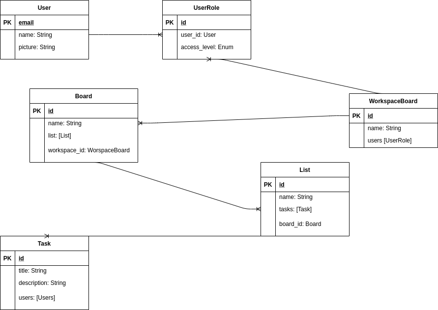

# Data Model

Contents:

* [Summary](#summary)
  * [Issue](#issue)
  * [Decision](#decision)
  * [Status](#status)
* [Notes](#notes)

## Summary

### Issue

We want to define our data model for this web app.

* Data model has to allow manege different workspaces boards
* Each user can be part of differents workspaces boards
* Each user must have a role in each workspaces boards
* Each workspace board can store multiple boards
* Inside each board can store multiple lists of taks
* Each task can be assigned to multiple users

### Decision

### Status

Data model proposed 

## Notes

Any notes here.